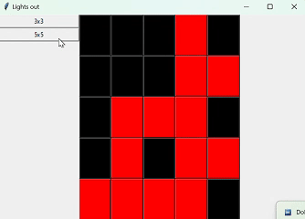

# Lern-Periode-8

# Lights out

Ein kleines Spiel, wo das Ziel ist, alle Feldern auszuschalten.

# Grobplanung

In dieser kurzen Zeit möchte ich Python ausprobieren. Und in letzter Zeit bin ich von dem Spiel "Lights Out" fasziniert. Ich möchte ein solches Spiel mit Python auf einem Grid erstellen. 

## 10/01

- [x] Ein Python für Anfänger Tutorial schauen, um zu wissen, wie man Variable, Methoden und Klassen erstellt
- [x] Python tkinter Tutorial schauen, um mit ein Grid zu spielen

Heute habe ich schnell gelernt. Zuerst habe ich entschieden, dass ich in VSC arbeiten werde. Danach habe ich paar Tutorials auf Youtube geschaut und gleicht gefolgt. Und mit dieser Hilfe kenne ich nun die Schreibweisen in Python. Am meisten neu fand ich, wie man Klassen erstellt. Ich weiss auch nun, dass ich ein Grid mit tkinter erstellen kann. Ausprobiert habe ich noch nicht. (63)

## 17/01

- [x] Einen Schreibassistenten installieren, um Befehle schneller zu schreiben und Fehler zu merken. Oder ähnliche Extensions installieren.

- [x] Ein graues 3x3 Grid erstellen

- [x] Ein Array von Farben erstellen

- [x] Auf Click die Farbe von Tile nach Array wächselt

Heute habe ich das Ziel erreicht. Ich habe wieder ein Tutorial zur Tkinter geschaut und den gefolgt und habe ein Grid erstellt. Ich habe diesen mit Buttons gefüllt. Danach ist aber das Problem enstanden. Wie wird die Farbe eines Buttons verändert? Ich habe überlegt, dass ein Button ein bewusster Objekt sein soll. Und die Lösung dazu habe ich auf internet gefunden. Ist noch am bisschen unverständlich, aber es reicht, da danach kann nun jeder Button eigene Farbe auf Druck verändern.

## 24/01

- [x] Die Buttons sollen eine Eigenschaft haben IsTurnedOn : bool

- [x] Die Buttons sollen entweder rot oder dunkel rot sein, je nach sie On oder Off sind.

- [x] Grid verkleinern. Es soll auf beiden seiten gleich viel Abstand haben und dann das Spiel in der Mitte.

- [x] Addiere Koordinaten Eigenschaft zu GameButton Klasse. Sie sollen wissen, wo sie sich befinden. 

Heute habe ich meine Ziele schnell erreicht. Zuerst habe ich ein neues Tutorial zum Python Klassen angeschaut. Ich fand der Unterschied zwischen Python und C# Klassen verwirrend. Aber dann habe ich es besser verstanden, und konnte ich neue Attribute zur Button addieren. Dann habe ich Grid in ein Frame verschoben, um nun das Spiel anzupassen. Gegen ende habe ich noch gitignore hinzugefügt und am Ende habe ich noch Problem gehabt, da ich nicht wusste, in welche init soll ich die neue Koordinaten  hinzufügen, da hat chatGPT geholfen. (87)

## 31/01

- [x] Mit einem Druck werden die benachbarten Buttons umgeschaltet

- [x] Links kann man mit Buttons entscheiden, wie gross das Grid sein soll

- [ ] Grid wird nach Grösse erstellt mit zufällig umgeschalteten Buttons

- [ ] Wenn sich alle Buttons in IsTurnedOn = True befinden, wird das Spiel beendet

Heute habe ich lange gearbeitet. Zuerst habe ich mich gefragt, wie kann ich global Koordinaten jeder Button stellen kann. In Python gibt es Dictionaries. Und sie können zwei Werte als Key haben also habe ich Dictionaries benutzt. Dann ist grösseres als ich gedacht habe Problem vorgekommen. Ich wollte mit einfacheren Buttons über die Grosse des Spielfelds verwalten. Schlüssendlich aber habe ich das ganze spiel in eine Klasse verschoben. Daraus habe ich wieder mit OOP gearbeitet und fühle mich sicherer mit Python. Heute konnte ich nicht alles umsetzen, da ich nachgelesen habe, dass das Spiel noch schlaue mathematik braucht, die ich noch wenig verstehe. (103)

# Reflexion

Das Spiel ist spielbereit. Es fehlt nur noch etwas, das über das zufällige Licht entscheidet. Aber als etwas Neues war es spannend. Ich habe mir Tutorials angeschaut und mich über die Entwicklungsumgebung informiert, und so sind die ersten Schritte vereinfacht. Während der Entwicklung habe ich gemerkt, dass es sich lohnt, mit Objekten zu programmieren. Ich finde, mit Objekten einfacher zu programmieren, und obwohl das Python eine neue Sprache war, habe ich mit der Zeit wegen der Objekte-Methode weniger Probleme gehabt und mehr Verständis bekommen. Auch oft fragte ich in ChatGPT nach, wo liegt das Fehler da ich viele Schreibweisen und Methoden nicht kannte. Auch deswegen konnte ich die Sprache besser lernen. Ich habe aber die Komplizität des Spiel unterschätzt, und deswegen bleibt sie nicht fertig. 

Für das nächste Mal möchte ich wieder mit Python arbeiten, da wir ein Modul darüber haben werden.  Ich möchte ein Labirynth Solver programmieren. Es wird auch ein Grid wie vorher haben. (156)
